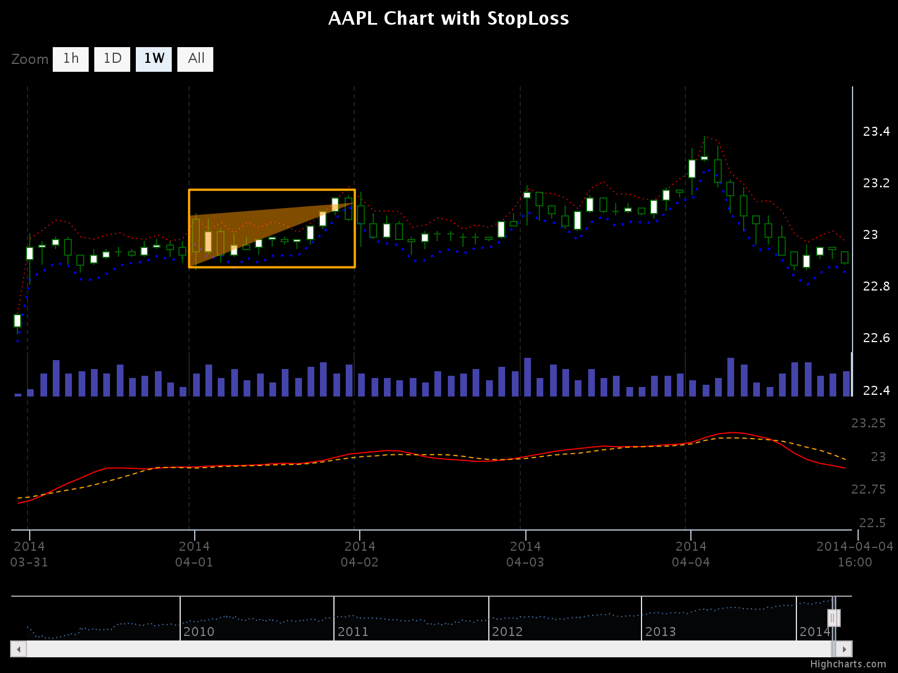
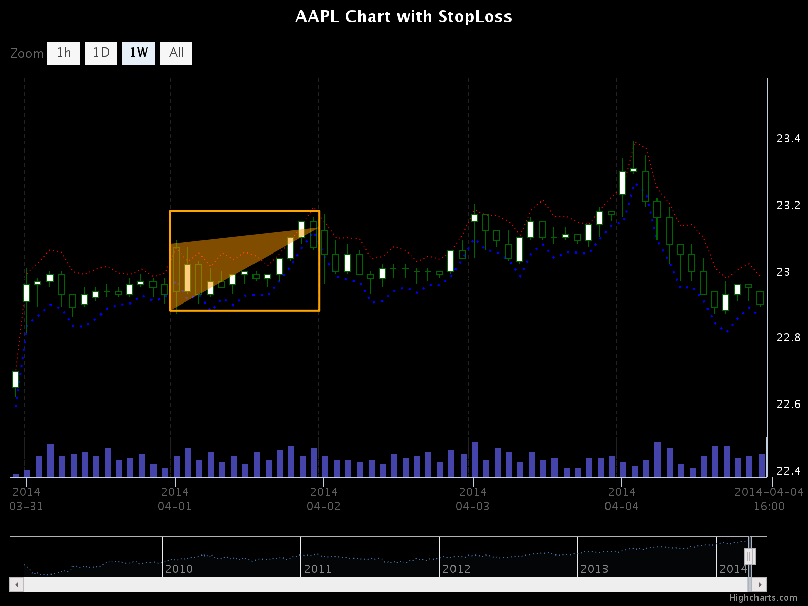
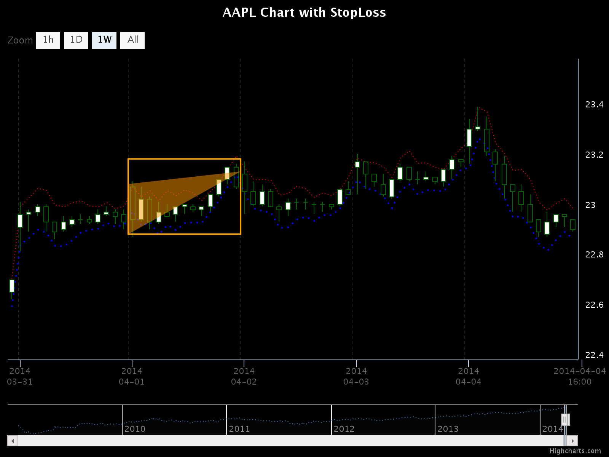

# Minimal documentation

RCandles -- R bindings to HighCharts for producing beautiful candlesticks charts

## Installation

```{r}
library(devtools)
devtools::install_github("redmode/RCandles")
```

## Usage

### Data load


```{r}
library(RCandles)

# Reads data
datafile <- "AAPL_bt_data.rda"
datavar <- load(datafile)
bt_data <- get(datavar) %>%
  mutate(Date = as.numeric(ymd_hm(Date)) * 1000) %>%
  tbl_df()

# Extracts prices
price_data <- bt_data %>%
  select(Date, Open, High, Low, Close)

# Adds fake volume
volume_data <- bt_data %>%
  select(Date) %>%
  rowwise() %>%
  mutate(Volume = round(runif(1, 1, 10)))

# Extracts StopLosses
ind_sl_buy <- bt_data %>%
  select(Date, Value = STOPLOSS_BUY)

ind_sl_sell <- bt_data %>%
  select(Date, Value = STOPLOSS_SELL)

# Calculates custom indicators
ind_sma13 <- price_data %>%
  mutate(Value = SMA(Close, n = 13)) %>%
  select(Date, Value) %>%
  na.omit()

ind_sma21 <- price_data %>%
  mutate(Value = SMA(Close, n = 21)) %>%
  select(Date, Value) %>%
  na.omit()
```

### Basic example

```{r}
RCandles(
  price_data,
  volume_data = volume_data,
  title = "AAPL Chart with StopLoss",
  width = 800,
  height = 600,
  background_color = "black",
  line_color = "darkgreen",
  up_color = "white",
  enable_hover = FALSE,
  enable_lower_window = TRUE,
  indicators = list(
           list(name = "SL_BUY", data = ind_sl_buy, color = "blue", type = "line", dashStyle = "dot", lineWidth = 2),
           list(name = "SL_SELL", data = ind_sl_sell, color = "red", type = "line", dashStyle = "dot"),
           list(name = "SMA13", data = ind_sma13, color = "red", type = "line", dashStyle = "solid", yAxis = 2),
           list(name = "SMA21", data = ind_sma21, color = "orange", type = "line", dashStyle = "dash", yAxis = 2)
         ),
  vertical_lines = as.numeric(c("2014-03-31 00:00 UTC",
                                "2014-04-01 00:00 UTC",
                                "2014-04-02 00:00 UTC",
                                "2014-04-03 00:00 UTC",
                                "2014-04-04 00:00 UTC") %>% ymd_hm()) * 1000
)
```




### Without lower window

```{r}
RCandles(
  price_data,
  volume_data = volume_data,
  title = "AAPL Chart with StopLoss",
  width = 800,
  height = 600,
  background_color = "black",
  line_color = "darkgreen",
  up_color = "white",
  enable_hover = FALSE,
  enable_lower_window = FALSE,
  indicators = list(
           list(name = "SL_BUY", data = ind_sl_buy, color = "blue", type = "line", dashStyle = "dot", lineWidth = 2),
           list(name = "SL_SELL", data = ind_sl_sell, color = "red", type = "line", dashStyle = "dot")
         ),
  vertical_lines = as.numeric(c("2014-03-31 00:00 UTC",
                                "2014-04-01 00:00 UTC",
                                "2014-04-02 00:00 UTC",
                                "2014-04-03 00:00 UTC",
                                "2014-04-04 00:00 UTC") %>% ymd_hm()) * 1000
)
```




### Without volume and lower window

```{r}
RCandles(
  price_data,
  title = "AAPL Chart with StopLoss",
  width = 800,
  height = 600,
  background_color = "black",
  line_color = "darkgreen",
  up_color = "white",
  enable_hover = FALSE,
  enable_lower_window = FALSE,
  indicators = list(
           list(name = "SL_BUY", data = ind_sl_buy, color = "blue", type = "line", dashStyle = "dot", lineWidth = 2),
           list(name = "SL_SELL", data = ind_sl_sell, color = "red", type = "line", dashStyle = "dot")
         ),
  vertical_lines = as.numeric(c("2014-03-31 00:00 UTC",
                                "2014-04-01 00:00 UTC",
                                "2014-04-02 00:00 UTC",
                                "2014-04-03 00:00 UTC",
                                "2014-04-04 00:00 UTC") %>% ymd_hm()) * 1000
)
```


