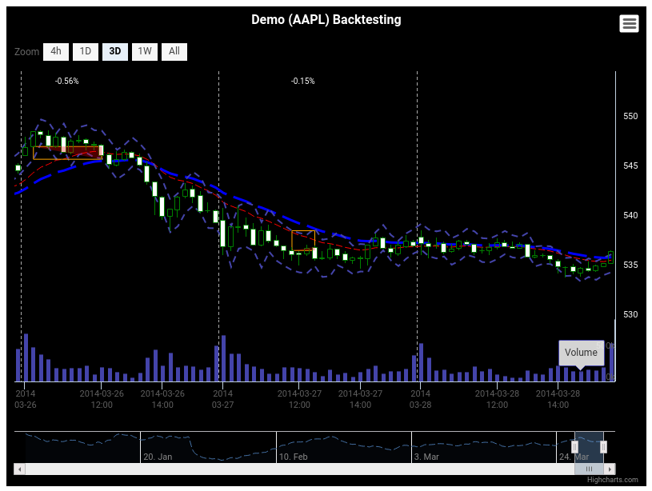
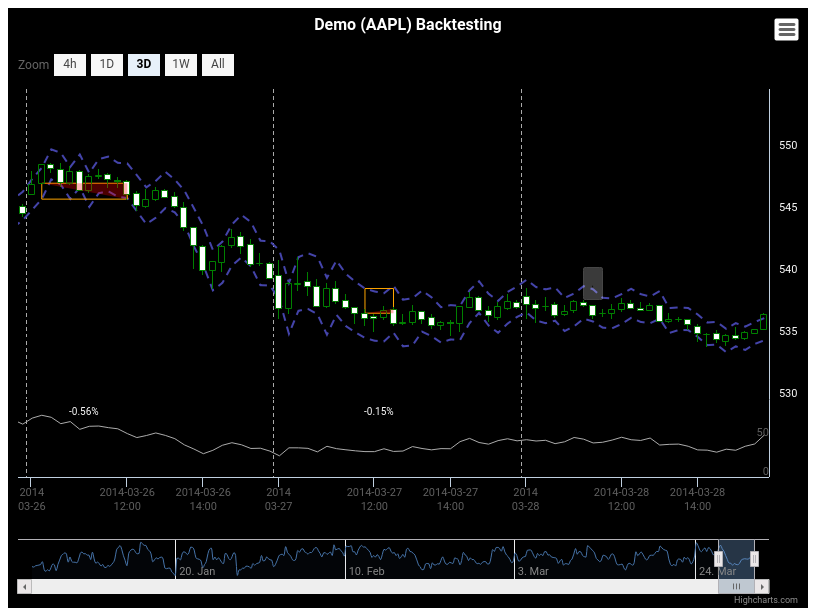
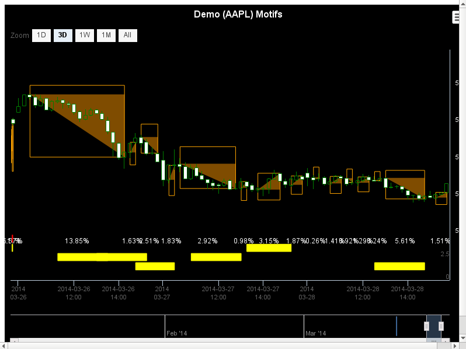

# Minimal documentation

RCandles -- R bindings to HighCharts for producing beautiful candlesticks charts

## Installation

```{r}
library(devtools)
devtools::install_github("redmode/RCandles")
```

## Usage for Backtesting visualization

```{r}
library(RCandles)


# (1) Loads data----------------------------------------------------------------

# Backtesting data
bt_file <- system.file("examples/bt_data.rda", package = "RCandles")
bt <- get(load(bt_file)) %>% tbl_df()

# Trades data
ar_file <- system.file("examples/ar_trades.Rdata", package = "RCandles")
ar <- get(load(ar_file)) %>% tbl_df()


# (2) Extracts info from data---------------------------------------------------

# Extracts prices
price_data <- bt %>%
  select(Date, Open, High, Low, Close)

# Adds fake volume
volume_data <- bt %>%
  select(Date) %>%
  rowwise() %>%
  mutate(Volume = round(runif(1, 1, 10))) %>%
  ungroup()

# Extracts StopLosses
stop_loss <- bt %>%
  select(Date, STOPLOSS_BUY, STOPLOSS_SELL)

# Loads trade logs
trades <- ar %>%
  select(TimeOpen, TimeClose, Type, OpenPrice, ClosePrice, SLprice, TPprice, Profit_Perc)
```  
  

```{r}
# (3) Plotting------------------------------------------------------------------

# Plots backtesting report (full info)
RBacktesting(
  price_data = price_data,
  volume_data = volume_data,
  stop_loss = stop_loss,
  trades = trades,
  title = "Demo (AAPL) Backtesting",
  width = 800,
  height = 600
)
```




```{r}
# Plots backtesting report (no volume)
RBacktesting(
  price_data = price_data,
  stop_loss = stop_loss,
  trades = trades,
  title = "Demo (AAPL) Backtesting",
  width = 800,
  height = 600
)
```



```{r}
# Plots backtesting report (no volume, no stoplosses)
RBacktesting(
  price_data = price_data,
  trades = trades,
  title = "Demo (AAPL) Backtesting",
  width = 800,
  height = 600
)
```


```{r}
# Plots backtesting report (no volume, no stoplosses, no trades)
RBacktesting(
  price_data = price_data,
  title = "Demo (AAPL) Backtesting",
  width = 800,
  height = 600
)  
```


## Usage for Motifs visualization


```{r}
library(RCandles)

# (1) Loads motifs--------------------------------------------------------------

# Loads backtesting data
bt_file <- system.file("examples/bt_data.rda", package = "RCandles")
bt <- get(load(bt_file)) %>% tbl_df()

ar_file <- system.file("examples/ar_trades.Rdata", package = "RCandles")
ar <- get(load(ar_file)) %>% tbl_df()

# Loads trade logs
logs_file <- system.file("examples/tradelogs.csv", package = "RCandles")
trades <- ar %>%
  select(TimeOpen, TimeClose, Type, OpenPrice, ClosePrice, SLprice, TPprice, Profit_Perc, rankfiltered)

# Loads motifs
motifs_file <- system.file("examples/motifs.RData", package = "RCandles")
motifs <- load(motifs_file)
motifs <- get(motifs[2]) %>% tbl_df()

# Extracts prices
price_data <- bt %>%
  select(Date, Open, High, Low, Close)

# Adds fake volume
volume_data <- bt %>%
  select(Date) %>%
  rowwise() %>%
  mutate(Volume = round(runif(1, 1, 10))) %>%
  ungroup()
```

```{r}
# Plots motifs
RMotifs(
  price_data = price_data,
  motifs = motifs,
  trades = trades,
  motif_names = c("dcba dcaa", "dcab dbab", "aacd abcd abdd", "babd bacd"),
  title = "Demo (AAPL) Motifs",
  width = 800,
  height = 600
)
```



```{r}
RMotifs(
  price_data = price_data,
  motifs = motifs,
  motif_top = 20,
  trades = trades,
  title = "Demo (AAPL) Motifs",
  width = 800,
  height = 600
)
```


