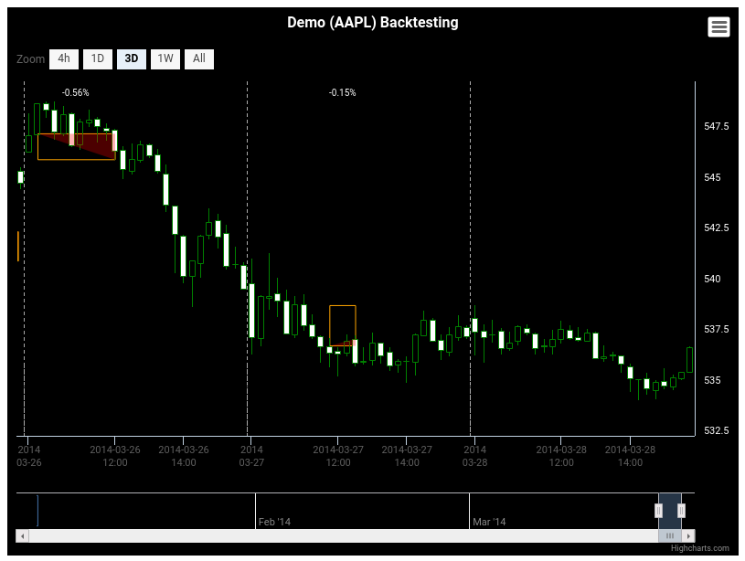

# Minimal documentation

RCandles -- R bindings to HighCharts for producing beautiful candlesticks charts

## Installation

```{r}
library(devtools)
devtools::install_github("redmode/RCandles")
```

## Usage for Backtesting visualization

```{r}
# (1) Loads data----------------------------------------------------------------

# Prices
prices <- readRDS(system.file("examples/prices.RData", package = "RCandles"))

# Trades
trades <- readRDS(system.file("examples/trades.RData", package = "RCandles"))

# Stoplosses
stop_loss <- readRDS(system.file("examples/stoploss.RData", package = "RCandles"))


# (2) Extracts info from data---------------------------------------------------

# Extracts prices
price_data <- prices %>%
  select(Date, Open, High, Low, Close)

# Extracts volume
volume_data <- prices %>%
  select(Date, Volume)

# Adds indicators
ema13 <- price_data %>%
  mutate(EMA = TTR::EMA(Close, n = 13)) %>%
  select(Date, EMA)

ema21 <- price_data %>%
  mutate(EMA = TTR::EMA(Close, n = 21)) %>%
  select(Date, EMA)

rsi <- price_data %>%
  mutate(RSI = TTR::RSI(Close, n = 13)) %>%
  select(Date, RSI)
```  
  

```{r}
# (3) Plotting------------------------------------------------------------------

#1 Plots backtesting report (full info)
RBacktesting(
  price_data = price_data,
  volume_data = volume_data,
  stop_loss = stop_loss,
  trades = trades,
  indicators = list(
    list(name = "EMA13", color = "red", data = ema13),
    list(name = "EMA21", color = "blue", data = ema21, lineWidth = 3)
  ),
  title = "Demo (AAPL) Backtesting",
  width = 800,
  height = 600
)
```


```{r}
#2 Plots backtesting report (with RSI)
RBacktesting(
  price_data = price_data,
  stop_loss = stop_loss,
  trades = trades,
  enable_lower_window = TRUE,
  indicators = list(
    list(name = "RSI", color = "#ababab", data = rsi, yAxis = 2, dashStyle = "solid")
  ),
  title = "Demo (AAPL) Backtesting",
  width = 800,
  height = 600
)
```


```{r}
#3 Plots backtesting report (no volume)
RBacktesting(
  price_data = price_data,
  stop_loss = stop_loss,
  trades = trades,
  title = "Demo (AAPL) Backtesting",
  width = 800,
  height = 600
)
```


```{r}
#4 Plots backtesting report (no volume, no stoplosses)
RBacktesting(
  price_data = price_data,
  trades = trades,
  title = "Demo (AAPL) Backtesting",
  width = 800,
  height = 600
)
```



```{r}
#5 Plots backtesting report (no volume, no stoplosses, no trades)
RBacktesting(
  price_data = price_data,
  title = "Demo (AAPL) Backtesting",
  width = 800,
  height = 600
)

```


